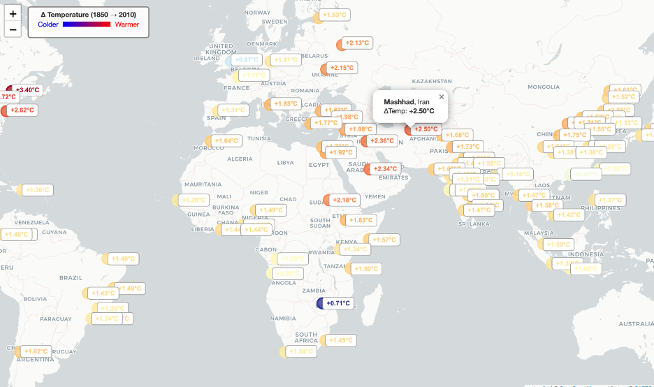
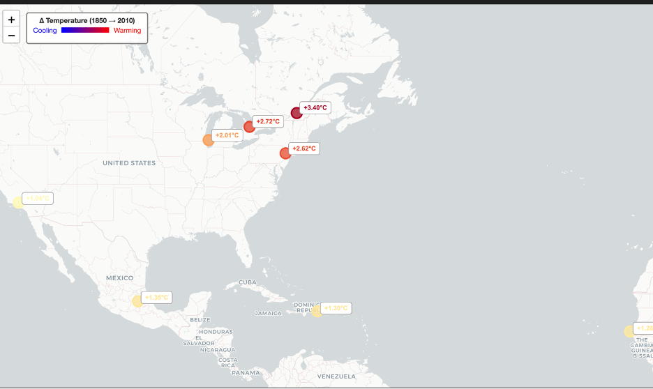
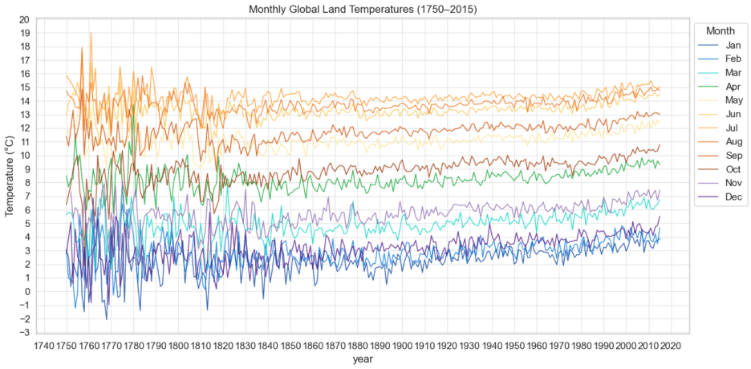
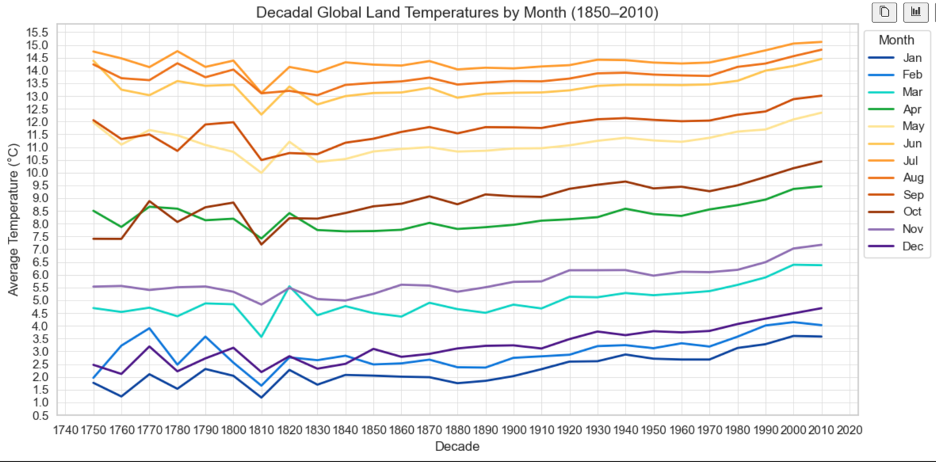

# climate_analysis

During the climate analyze was chosen, two datasets were chosen: global land temperatures by major city and global temperature change. The idea was to discover how the average temperature changes over the years and what parts of the world are more exposed to climate change.

At first, the cities dataset was explored. To see the overall trends in temperature changes in cities over time, the monthly temperatures were averaged to show a smoother change over the years. 9 random cities were plotted on the line plots. The overall trend shows that temperatures are increasing in cities over the years. However, the change is not linear. The average annual temperature changes from year to year, showing an increase in one year and a decrease in another.

To see a smoother picture, the annual temperature was averaged into temperatures over decadal periods (every 10 years), starting from 1850 and ending in 2010. The result shows smoother lines and a clearer trend of decreasing temperatures in cities.

Moving farther was chosen to compare the temperature change of the first recorded decade, 1850-1860, with the latest recorded 2000-2010. Having latitude and longitude coordinates in the dataset, the average of the temperature change was calculated and plotted on the map. The results reveal a picture that the average temperature change is not uniformly distributed over the cities. The map shows that temperature change ranges from +0.7 °C to +3.4 °C. The biggest warming is observed in Canada (Montreal, Toronto, +3.4 °C), the northeastern United States (New York, +2.6 °C), Eastern Europe (+2 °C), and East Asia (+2.4 °C).

 

When studying the phenomenon of uneven distribution of temperature changes, it was found that the temperature changes more where there are large areas of land, and where wind masses come from large areas of land. Also, the industrialization of cities is one of the factors of warming in these places.

After determining the pattern of warming in cities and investigating the causes of this, it was decided to continue researching global trends in global temperature change using global temperature data.

The global temperature change over the year for each month was plotted on the line plot. The investigation shows that in the period from 1750 to 1840 yearly global temperature over month was large deviated. It might indicate uncertainty in temperature record since the field corresponding to land average temperature uncertainty is large at this period comparing to latest years. 

The global temperature change over the year for each month was plotted on the line plot. The investigation shows that in the period from 1750 to 1840 yearly global temperature over the month was large deviated. It might indicate uncertainty in the temperature record since the field corresponding to land average temperature uncertainty is large during this period compared to the latest years. Similar to the cities dataset, it is hard to describe the change over time using yearly changes since the temperature average is increasing and decreasing over the years. Therefore, another plot was made for the change in temperature over the decade starting from 1750 and ending in 2010. 

Since the average temperature between 1750 and 1820 is less certain, the following description of temperature trends will be based on data from 1820 to 2010. Overall, the global temperature during warmer months (from May to September) increases by about +0.5 °C from 1820 to around 1980. After 1980, the warming rate accelerated, reaching nearly +1 °C above 19th-century averages.  Cooler months (January, February, December) display a more linear but stronger rise, with temperature increases of approximately +1.5 °C since 1820. While the annual temperatures fluctuate due to natural variability, the decadal trends reveal a clear and accelerating pattern of global warming, with stronger temperature anomalies emerging after the late 20th century.   
 
